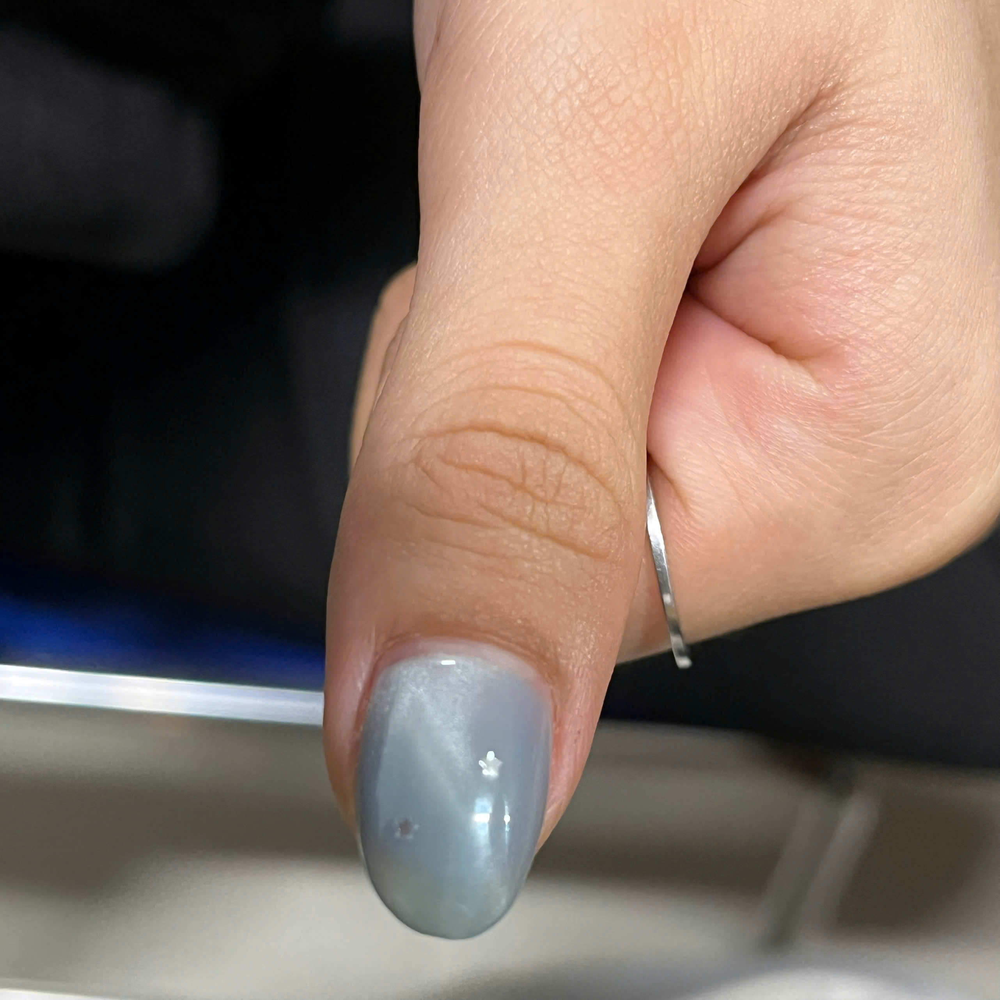
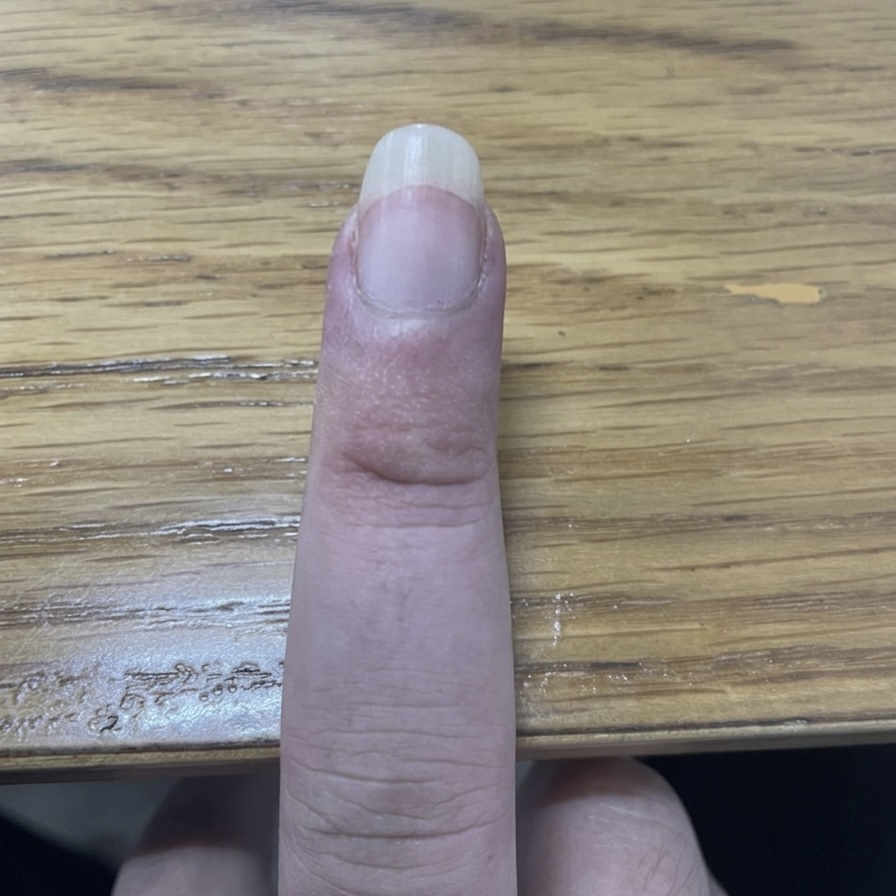
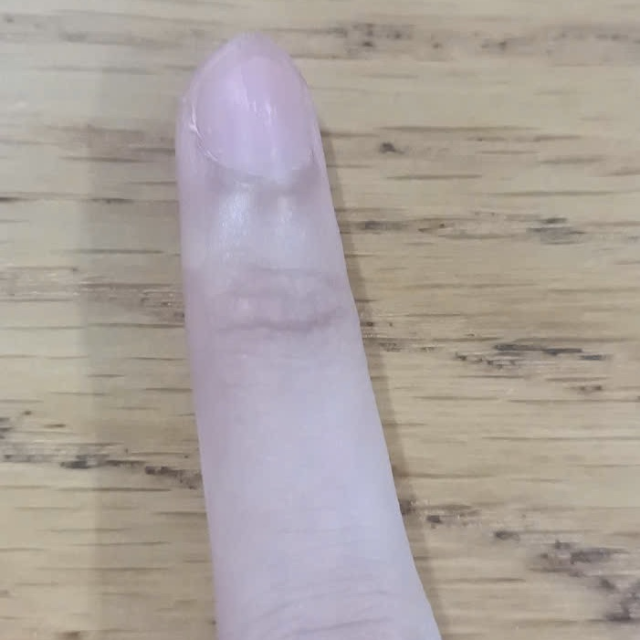

# nail-recognition
# Đồ án: Nhận diện Móng tay (Nail Recognition) 💅

## 📌 Tiến độ Tuần 1: Chuẩn bị dữ liệu

### 1. Minh họa các lớp dữ liệu
Dưới đây là hình ảnh thực tế nhóm đã thu thập:

| Painted_Nail | Long_Nail | Short_Nail |
| :---: | :---: | :---: |
|  |  |  |

### 2. Thống kê
- **Tổng số ảnh:** 248 ảnh.
- **Tập Train:** 188 ảnh.
- **Tập Val:** 60 ảnh.

### 3. Mã nguồn
Chi tiết xử lý dữ liệu: [Tuan1_ChuanBiDuLieu.ipynb](Tuan1_ChuanBiDuLieu.ipynb)

### 🚧 Tiến độ Tuần 2: Xây dựng Model & Huấn luyện bước đầu
- Thiết lập kiến trúc mô hình Transfer Learning với **MobileNetV2** (đóng băng trọng số gốc).
- Áp dụng Data Augmentation để xử lý vấn đề thiếu hụt dữ liệu (248 ảnh).
- Đã tiến hành chạy huấn luyện lần 1 (Initial Training - 30 epochs) để lấy mức cơ sở (Baseline).
- **Kết quả bước đầu:** Mô hình (best_model.h5) đạt Accuracy tập kiểm định (Val) ở mức **~74%**.
- Chi tiết mã nguồn và biểu đồ: [Tuan2_HuanLuyenMoHinh.ipynb](Tuan2_HuanLuyenMoHinh.ipynb)
